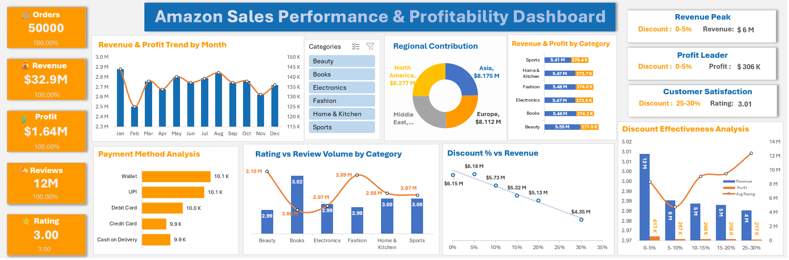

# Amazon Product Performance & Customer Engagement Analytics

## Project Overview

This interactive Excel dashboard transforms over 50,000 raw Amazon order records (2022–2023) into actionable business insights. It provides executives with an instant look at revenue health, net profitability margins, regional demand distributions, and customer satisfaction metrics.

## Objectives
- Analyze Revenue and Profit
- Study Discount Impact
- Product Category Analysis
- Customer Rating Analysis

## Dashboard Preview

## Dashboard Features
- KPI Cards
- Revenue Trend Analysis
- Profit Analysis
- Discount Bucket Analysis
- Rating vs Revenue Analysis
- Interactive Slicers

## Tools Used
- Microsoft Excel
- Pivot Tables
- Pivot Charts
- Slicers
- Conditional Formatting

## Key Business Takeaways
- Revenue vs. Profit Velocity: While sales volume peaks consistently in specific months, profit margins fluctuated due to aggressive discounting structures in categories like Electronics.
- Regional Value: North America and Asia represent our highest-grossing territories, combining for over X% of global revenue.
- Transaction Preferences: Digital payment channels (UPI and Credit Cards) capture the vast majority of consumer purchases, dwarfing cash-on-delivery options.

## Technical Implementations
- Data Cleaning & Engineering: Handled missing elements, structured data formats, and eliminated table anomalies using Excel tables.
- Advanced Pivot Architectures: Built isolated analytical backend engines to feed visual elements seamlessly without memory lag or #SPILL! errors.
- Dynamic UI/UX Design: Configured multi-canvas interactive slicers, cross-filtering report connections, custom KPI summary cards, and dual-axis combo charts.

